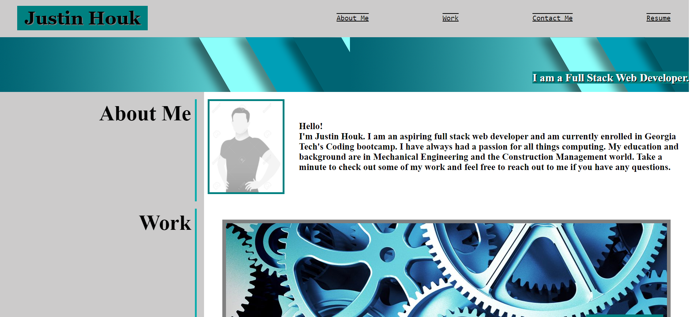
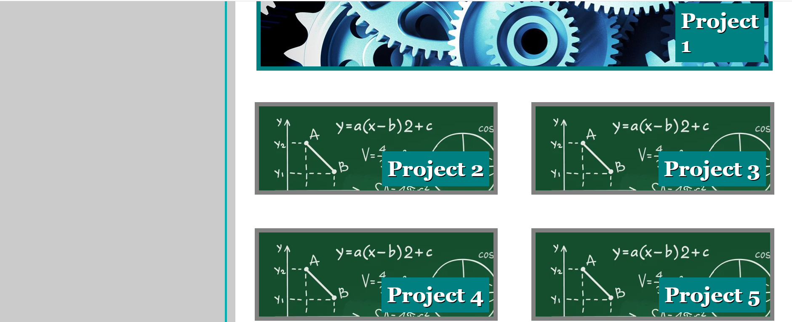

# My Professional Portfolio:  Justin Houk
## Overview

This is my professional homepage that puts on display what I have created to show my software development skills and experience.  Here you can find links to my social media pages, ways to contact me, and a copy of my most up-to-date resume.  In my projects section, you can find links to my github repository for each project, as well as the deployed applications, if applicable.  If there is not a deployed application, check out the github repository.  Many of my applications are back-end only or are terminally executed applications that cannot be deployed.  Please feel free to reach out to me at my email: jstndhouk@gmail.com with any opportunities or feedback on any of the content found within.  Thanks for visiting!

## Development Tools Used
Google fonts
Bootstrap
Icons used: https://devicon.dev/

## Deployed Webpage

https://jstndhouk.github.io/Professional-Portfolio/

<!-- ## Snippet

 -->
