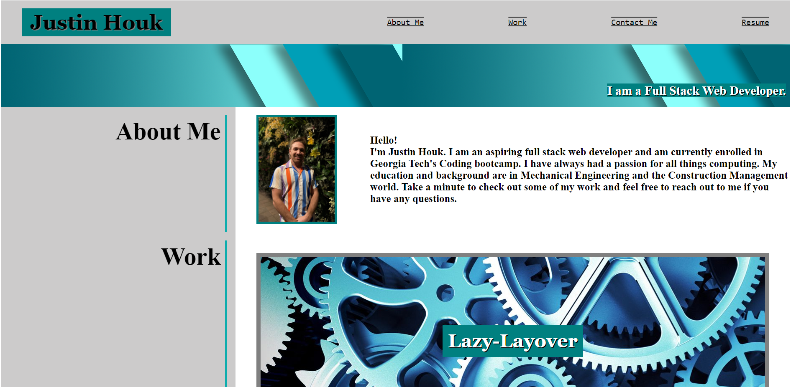
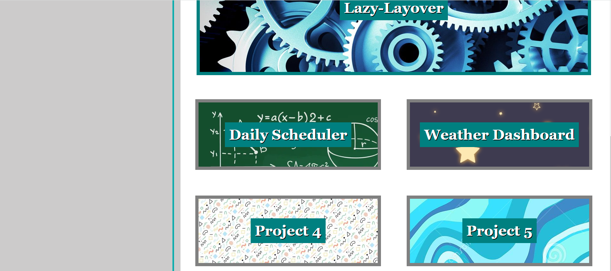
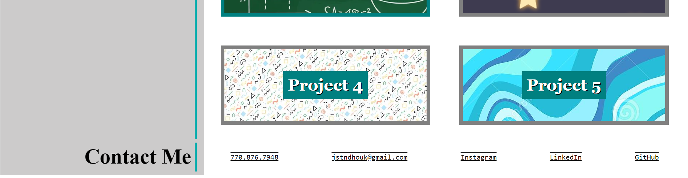

# My Professional Portfolio:  Justin Houk
## Overview

This purpose of this application is to tell accompany my resume by telling employers a little bit about me and my work.  It also gives them my contact information and social media so that they can reach out to me if they're interested in my work.  This application was made using flex boxes in the row direction, then to the column direction when the browser approaches mobile dimensions.  It includes links to my social media pages, a photo of myself (to be added once a professional photo is taken) and links at the top to quickly point the user to the sections they would like to view.  My resume is also linked to a dropbox link at the top of the page.

## Deployed Webpage

https://jstndhouk.github.io/Professional-Portfolio/

## Snippet

